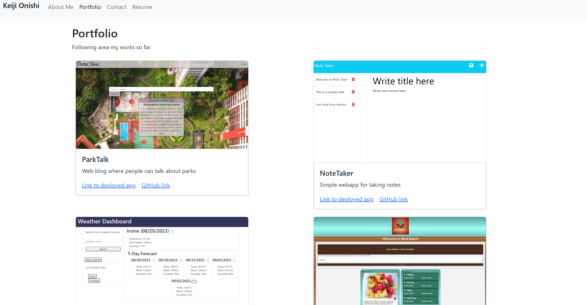

# Portfolio-by-React

## Description

This is my updated portfolio page using [React](https://react.dev/), and CSS by [Bootstrap](https://getbootstrap.com/). Working on this project allowed my to learn and practice working with React to create a simple webapp. It also reinforced my knowledge for Bootstrap.

## Table of Contents

- [Portfolio-by-React](#portfolio-by-react)
  - [Description](#description)
  - [Table of Contents](#table-of-contents)
  - [Installation](#installation)
  - [Usage](#usage)
  - [License](#license)
  - [Questions](#questions)

## Installation

No installation is neccessary to access this project.

## Usage

Please go to the following [URL](https://meekunn1.github.io/Portfolio-by-React/) to get this project. You can use the navbar on top of the page to navigate through the pages. The form on "Contact" page is not yet functional at this stage.

## License
  

## Questions

For any questions, please visit my [GitHub profile](https://github.com/meekunn).

For any additinal questions, please contact me through email at: meekunn@gmail.com